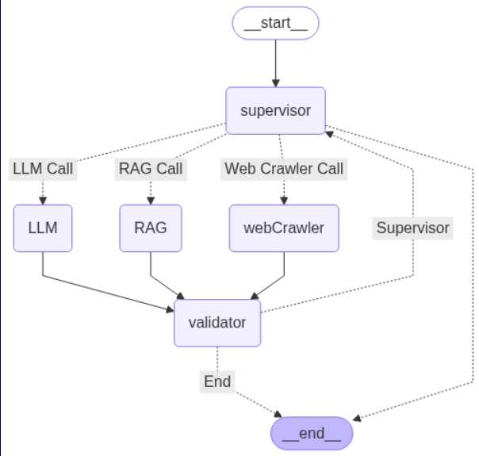

# AI Assistant with Dynamic Routing System

WorkFlow


## Overview

This project implements an intelligent AI assistant that dynamically routes user queries to the most appropriate processing module based on content classification. The system uses a LangGraph workflow with multiple specialized nodes for different types of queries.

## Key Features

- **Smart Query Classification**: Automatically categorizes user questions
- **Multi-Processing Paths**:
  - RAG (Retrieval-Augmented Generation) for structured data queries
  - Web Crawler for real-time information
  - General LLM for other queries
- **Validation System**: Ensures response quality before final delivery
- **Self-Correcting**: Automatically retries with alternative methods if validation fails

## System Components

### Core Nodes

1. **Supervisor Node**:
   - Classifies incoming queries into categories
   - Determines the processing path

2. **Router Function**:
   - Directs queries to appropriate processing nodes
   - Handles flow control between components

3. **Processing Nodes**:
   - **LLM Node**: General question answering
   - **RAG Node**: For USA/GDP-related queries (uses Chroma vectorstore)
   - **Web Crawler Node**: Fetches real-time news/weather data

4. **Validator Node**:
   - Evaluates response quality
   - Triggers reprocessing if needed

## Installation

1. Clone the repository:
   ```bash
   git clone https://github.com/rohit83r/Intelligent-Output-Generation-Graph.git
   cd Intelligent-Output-Generation-Graph
   ```

2. Install dependencies:
   ```bash
   pip install -r requirements.txt
   ```

3. Set up environment variables:
   - Create a `.env` file with your API keys:
     ```
     GOOGLE_API_KEY=your_google_api_key
     ```


### Example Queries

1. For USA/GDP information:
   ```python
   {"messages": [HumanMessage(content="GDP of USA")]}
   ```

2. For latest news:
   ```python
   {"messages": [HumanMessage(content="latest news in new delhi")]}
   ```

3. For general questions:
   ```python
   {"messages": [HumanMessage(content="Tell me about quantum computing")]}
   ```

## Workflow Diagram


The system follows this decision flow:
1. User query → Supervisor classification
2. Routing to appropriate processor
3. Validation check
4. Either:
   - Deliver response (if validated)
   - Retry with alternative method (if validation fails)

## Dependencies

- Python 3.8+
- LangChain
- LangGraph
- Google Generative AI
- HuggingFace Embeddings
- ChromaDB
- BeautifulSoup (for web crawling)

## Configuration

Modify these files for customization:
- `data/` - Add your own documents for RAG


